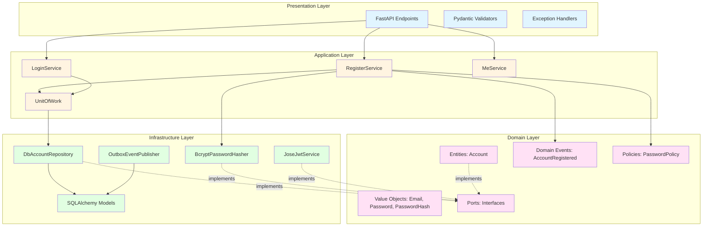
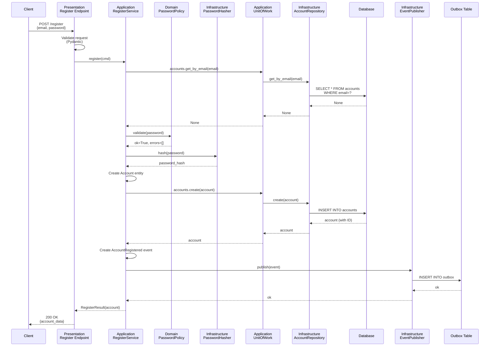

# DDD Architecture Overview

## Layered Architecture

Проект реализует чистую слоистую архитектуру согласно принципам Domain-Driven Design (DDD).

### Diagram: Layered DDD Architecture



### Dependency Rule

**Зависимости направлены внутрь к Domain слою:**
- Presentation → Application → Domain ← Infrastructure
- Domain не зависит ни от чего (чистая бизнес-логика)
- Infrastructure зависит от Domain (реализует порты)
- Application организует бизнес-процессы используя Domain

## User Registration Flow

### Sequence Diagram: User Registration



## DDD Tactical Patterns

### 1. Aggregate Root

**Account** является Aggregate Root:
- Инкапсулирует бизнес-логику и инварианты
- Имеет уникальный идентификатор
- Контролирует доступ к внутренним сущностям
- Эмитит domain events при изменении состояния

```python
@dataclass
class Account:
    """Aggregate Root для аутентификации и авторизации."""
    
    identifier: UUID | None
    email: Email
    password_hash: PasswordHash
    is_active: bool = True
    username: str | None = field(default=None)
    roles: list[Role] = field(default_factory=list)
    
    # Бизнес-методы
    def change_password(self, new_hash: PasswordHash) -> AccountPasswordChanged:
        """Change password and emit event."""
        
    def activate(self) -> AccountActivated:
        """Activate account and emit event."""
        
    def deactivate(self) -> AccountDeactivated:
        """Deactivate account and emit event."""
```

### 2. Value Objects

Неизменяемые объекты, определяемые своими атрибутами:
- **Email** - email адрес с валидацией
- **Password** - пароль в открытом виде
- **PasswordHash** - хэш пароля
- **Role** - роль пользователя
- **AccessToken / RefreshToken** - JWT токены
- **TTL** - time to live для токенов

### 3. Domain Events

События, которые произошли в domain слое:
- **AccountRegistered** - аккаунт создан
- **AccountAuthorized** - пользователь авторизовался
- **AccountPasswordChanged** - пароль изменен
- **AccountActivated / AccountDeactivated** - статус изменен

### 4. Repository Pattern

Абстракция для доступа к данным:
```python
class AccountRepository(Protocol):
    async def get_by_email(self, email: Email) -> Account | None: ...
    async def get_by_id(self, account_id: UUID) -> Account | None: ...
    async def create(self, account: Account) -> Account: ...
    async def exists(self, email: Email) -> bool: ...
    async def find_by_specification(self, spec: Specification) -> list[Account]: ...
```

Реализация: **DbAccountRepositoryImpl** (Infrastructure)

### 5. Unit of Work Pattern

Координирует изменения в нескольких репозиториях в рамках транзакции:
```python
async with self.uow as uow:
    account = await uow.accounts.get_by_email(email)
    # ... бизнес-логика ...
    await uow.accounts.create(account)
    # Транзакция commit происходит автоматически
```

### 6. Specification Pattern

Для сложных запросов с комбинацией условий:
```python
spec = ActiveAccountsSpec().and_(EmailDomainSpec('gmail.com'))
accounts = await repo.find_by_specification(spec)
```

### 7. Domain Services

Для бизнес-логики, которая не принадлежит одному агрегату:
- **PasswordPolicySuite** - проверка политик паролей

### 8. Application Services

Организуют use cases, координируют Domain и Infrastructure:
- **RegisterService** - регистрация пользователя
- **LoginService** - аутентификация
- **MeService** - получение информации о текущем пользователе

### 9. Ports and Adapters (Hexagonal Architecture)

Domain определяет интерфейсы (Ports), Infrastructure реализует (Adapters):

**Ports (в domain/ports.py):**
- PasswordHasher
- JwtService
- AccountRepository
- DomainEventPublisher

**Adapters (в infrastructure/):**
- BcryptPasswordHasher (infra/crypto/bcrypt.py)
- JoseJwtService (infra/jwt_service/jose.py)
- DbAccountRepositoryImpl (infra/repositories/account/db.py)
- OutboxEventPublisher (infra/messaging/outbox_publisher.py)

## Result Pattern

Функциональный подход к обработке ошибок вместо exceptions:

```python
@dataclass(frozen=True)
class Result(Generic[T, E]):
    """Результат операции: Success или Failure."""
    
@dataclass(frozen=True)
class Success(Result[T, E]):
    value: T
    
@dataclass(frozen=True)
class Failure(Result[T, E]):
    error: E

# Использование
result = await service.register(cmd)
match result:
    case Success(account):
        return {"account": account}
    case Failure(error):
        raise error
```

## Рекомендации по рефакторингу

### Приоритет 1: Domain Layer

1. **Сделать Account полноценным Aggregate Root:**
   - Добавить бизнес-методы (change_password, activate, deactivate)
   - Методы должны эмитить domain events
   - Добавить проверку инвариантов
   - Сделать поля приватными с property

2. **Улучшить Value Objects:**
   - Добавить валидацию в конструктор
   - Обеспечить immutability
   - Добавить полезные методы

### Приоритет 2: Application Layer

1. **Внедрить Result Pattern:**
   - Заменить exceptions на Result<Success, Failure>
   - Улучшить композицию операций
   - Упростить тестирование

2. **Улучшить Application Services:**
   - Разделить команды и запросы (CQRS)
   - Добавить transaction decorators
   - Улучшить error handling

### Приоритет 3: Infrastructure Layer

1. **Расширить Repository:**
   - Добавить поддержку Specification pattern
   - Добавить методы exists(), count()
   - Добавить batch операции
   - Улучшить логирование и мониторинг

2. **Улучшить Unit of Work:**
   - Поддержка nested transactions
   - Rollback strategies
   - Event collection и dispatch

### Приоритет 4: Testing

1. **Domain Tests (чистые unit-тесты):**
   - Не требуют БД, моков, DI
   - Тестируют бизнес-логику
   - Быстрые и надежные

2. **Application Tests:**
   - Mock repositories
   - In-memory UoW
   - Тестируют use cases

3. **Integration Tests:**
   - Используют реальную БД
   - Тестируют полный flow

## Преимущества архитектуры

✅ **Тестируемость:** Domain слой тестируется без моков и БД  
✅ **Независимость от фреймворков:** Domain не зависит от FastAPI, SQLAlchemy  
✅ **Масштабируемость:** Легко добавлять новые use cases  
✅ **Поддерживаемость:** Четкое разделение ответственности  
✅ **Гибкость:** Легко менять Infrastructure (БД, фреймворк)  
✅ **Понятность:** Код отражает бизнес-процессы  

## Метрики качества

- **Domain Coverage:** > 90% (чистые unit-тесты)
- **Application Coverage:** > 85% (с моками)
- **Integration Coverage:** > 70% (full stack)
- **Cyclomatic Complexity:** < 6 (ruff настройки)
- **Type Coverage:** 100% (mypy strict mode)

## Ссылки

- [Tactical DDD Patterns](https://www.domainlanguage.com/ddd/)
- [Clean Architecture by Uncle Bob](https://blog.cleancoder.com/uncle-bob/2012/08/13/the-clean-architecture.html)
- [Hexagonal Architecture](https://alistair.cockburn.us/hexagonal-architecture/)
